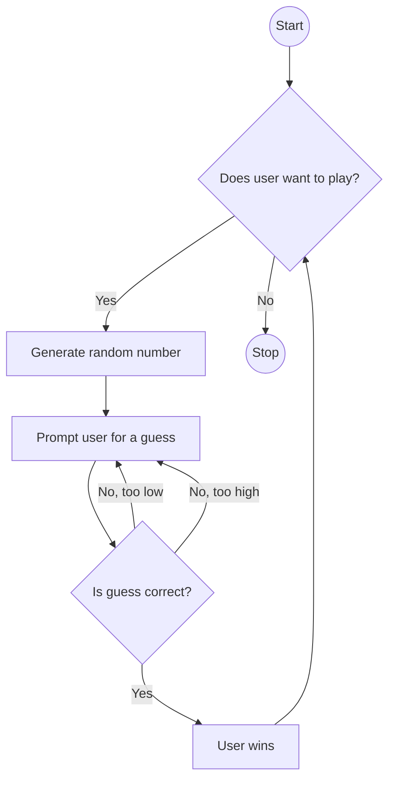

# Learn Lua
Going through the Learn X in Y Minutes Lua guide, plus a number guessing game.

## Flowchart

```mermaid
flowchart TB
    Start(("Start")) --> Ask{"Does user want to play?"}
    Ask -- Yes --> Generate["Generate random number"]
    Ask -- No --> Stop(("Stop"))
    Generate --> Prompt["Prompt user for a guess"]
    Prompt --> Check{"Is guess correct?"}
    Check -- No, too low --> Prompt
    Check -- No, too high --> Prompt
    Check -- Yes --> Win["User wins"]
    Win --> Ask
```
